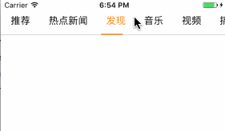
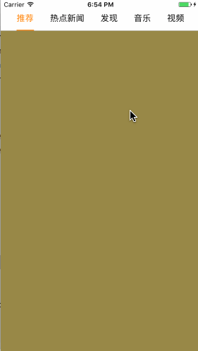

如果您是使用 `Swift` 编写项目，可移步<a href="https://github.com/WJCha/WJPageView">WJPageView</a>, 因为`WJPageView`将更加完善

---
# WJPageManager
# 简介

- WJPageManager提供了可以快速完成项目中常见的标题栏以及对应的分页控制器创建与逻辑处理
- WJPageManager主要分为两个类。
  - **WJPageTitleView 对应标题，通过他可以创建标题栏**
  - **WJPageContentView 对应标题分页控制器**
- 相关特性：
  - 分页控制器的创建为懒加载方式。用到时才创建。
  - 通过监听重复点击标题发出的通知完成下拉刷新操作
  - 可以统一设置标题栏以及标题相关属性
  - 标题与分页控制器需要通过他们之间的代理完成切换的逻辑


# 效果演示

  


 


# 安装方式

- 手动安装：下载当前项目，将`WJPageManage`文件夹拖入项目中即可
- CocoaPods 安装：`pod 'WJPageManager'`


# 使用方法

导入头文件：`#import "WJPageManager.h"`

### 创建标题栏

```objc
// 创建标题栏的方式：

/**
 快速设置 PageTitleView，标题默认普通状态颜色为black，选中状态颜色为orange，字体大小为 14

 @param frame 设置pageTitleView的位置和尺寸
 @param titles 需要显示的标题数组
 @return self
 */
- (instancetype)initWithFrame:(CGRect)frame titles:(NSArray *)titles;


/**
 快速设置 PageTitleView，标题默认普通状态颜色为black，选中状态颜色为orange，字体大小为 14
 
 @param frame 设置pageTitleView的位置和尺寸
 @param titles 需要显示的标题数组
 @return self
 */
+ (instancetype)pageTitleViewWithFrame:(CGRect)frame titles:(NSArray *)titles;


  // 或者：
  CGRect frame = CGRectMake(0, kStatuBarH, kScreenW, kTitleViewH);
  NSArray *titles = @[@"推荐", @"热点新闻", @"发现", @"音乐", @"视频", @"搞笑", @"小品", @"社会"];
  WJPageTitleView *titleView = [[WJPageTitleView alloc] init];
  self.titleView.frame = frame;
  titleView.titles = titles;
  self.titleView = titleView;
  //....


```


#### 统一对标题栏以及标题进行属性设置

- 默认标题的正常状态的颜色为黑色，选中状态颜色为橙色，字号为15。
- 关于标题栏的默认设置可以在`WJPageTitleViewConfig`类里面的`+ (instancetype)defaultConfig`方法查看。

```objc
  // 统一设置标题栏及标题相关属性的方法
  [titleView titleBarWithConfiguration:^(WJPageTitleViewConfig *config) {
      config.tileFont = [UIFont systemFontOfSize:16];
  	  // ...
   
  }];

// 提供设置的属性有：
/** 标题栏的背景颜色 */
@property (nonatomic, strong) UIColor *titleBarBgColor;
/** 标题的正常状态的颜色 */
@property (nonatomic, strong) UIColor *titleNormalColor;
/** 标题的选中状态的颜色 */
@property (nonatomic, strong) UIColor *titleSelectColor;
/** 标题字体 */
@property (nonatomic, strong) UIFont *tileFont;

/** 指示器的高度 */
@property (nonatomic, assign) CGFloat scrollLineHeight;

/** 标题栏底线的高度 */
@property (nonatomic, assign) CGFloat titleBarDownLineHeight;
/** 标题栏底线的背景颜色 */
@property (nonatomic, strong) UIColor *titleBarDownLineBgColor;
/** 标题栏底线的透明度 */
@property (nonatomic, assign) CGFloat titleBarDownLineAlpha;
```


### 创建分页控制器

```objc
/**
 自定义构造方法，快速创建分页控制器

 @param frame 尺寸
 @param parentVc 父控制器
 @param childVcs 子控制器数组
 */
- (instancetype)initWithFrame:(CGRect)frame parentViewController:(UIViewController *)parentVc childViewControllers:(NSArray<UIViewController *> *)childVcs;
+ (instancetype)pageContentViewWithFrame:(CGRect)frame parentViewController:(UIViewController *)parentVc childViewControllers:(NSArray<UIViewController *> *)childVcs;
```


### 标题与分页控制器的逻辑处理

- 标题和分页控制器间的交互是通过代理的方式完成的。通过代理完成他们之间的交互。

#### 标题的代理方法

如果通过点击标题滚动到对应的分页控制器，通过设置标题的代理，实现以下代理方法就可以获取到当前点击的标题索引。

```objc
/**
 告诉代理当前点击的标题按钮的索引

 @param pageTitleView pageTitleView
 @param titleIndex 当前点击的标题按钮的索引
 */

- (void)pageTitleView:(WJPageTitleView *)pageTitleView didSelectTitleIndex:(NSInteger)titleIndex;
```


获取到点击的标题索引后，就可以通过调用分页控制器对外暴露的方法让分页控制器发生滚动

```objc
/**
 根据索引滚动到对应的分页页面
 
 @param index 索引
 */
- (void)scrollPageToIndex:(NSInteger)index;
```


#### 分页控制器的代理方法

如果要想实现拖拽控制器的时候，完成标题的指示器进行滚动到分页控制器对应的标题，只需设置分页控制器的代理即可

设置分页控制的代理，通过代理方法可以获取到当拖拽分页时，就会将当前分页的拖拽进度等信息给代理

```objc
/**
 当 pageContentView 滚动的时候会将滚动进度以及当前、下一个页面告诉代理。
 

 @param pageContentView  self
 @param progress 滚动进度
 @param sourceIndex 滚动前的当前页面
 @param targetIndex 下一个页面
 */
- (void)pageContentView:(WJPageContentView *)pageContentView progress:(CGFloat)progress sourceIndex:(NSInteger)sourceIndex targetIndex:(NSInteger)targetIndex;
```

获取到响应的信息后，就可以通过调用标题对外暴露的方法，让标题进行相应的操作了。

```objc
/**
 根据 pageContentView 的滚动进度等信息设置指示器以及标题的状态。
 如果点击标题，滚动到对应的 pageContentView 可以通过 pageContentView 的代理方法获得 pageContentView 的拖拽页面相关信息。然后调用该方法设置标题的指示器

 @param progress pageContentView滚动进度
 @param sourceIndex 页面滚动前所在的索引
 @param targetIndex 将要滚动到的下一个页面的索引
 */
- (void)setTitleStatusChangeWithProgress:(CGFloat)progress sourceIndex:(NSInteger)sourceIndex targetIndex:(NSInteger)targetIndex;
```


### 监听标题重复点击发出的通知

- 如果有重复点击标题，需要进行下拉刷新操作的需求。可以通过监听标题重复点击发出的`WJPageTitleButtonDidRepeatClickNotification`通知完成
- 案例可以查看 `demo`


